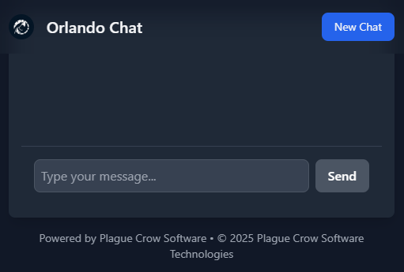
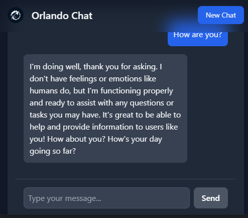

# Orlando Chat - Documentación del Proyecto

 <!-- Agrega una captura de pantalla aquí si la tienes -->

## Descripción

Orlando Chat es una aplicación web de chat interactivo que utiliza un modelo de lenguaje basado en Meta-Llama 3.1-8B-Instruct-GGUF, integrado con un backend en Python (Flask) y un frontend moderno construido con React y Tailwind CSS.

---

## Características Principales

- **Interfaz de chat moderna y responsive**.
- **Integración con modelos de lenguaje local** (LM Studio).
- **Efecto de escritura en tiempo real** para las respuestas del asistente.
- **Historial de conversación** persistente durante la sesión.
- **Diseño personalizable** con Tailwind CSS.
- **Fácil de implementar** con Flask y React.

---

## Requisitos del Sistema

- Python 3.8 o superior.
- Node.js (opcional, solo si modificas el frontend).
- LM Studio (para ejecutar el modelo de lenguaje localmente).

---

## Instalación

### 1. Clonar el repositorio

```bash
git clone https://github.com/Orlanstein/LMStudioAndPythonBackendTailScale.git
cd LMStudioAndPythonBackendTailScale
```

### 2. Instalar dependencias de Python

```bash
pip install -r requirements.txt
```

### 3. Configurar LM Studio

1. Descarga e instala [LM Studio](https://lmstudio.ai/).
2. Descarga el modelo `Meta-Llama-3.1-8B-Instruct-GGUF` desde LM Studio
   del siguiente repositorio [`lmstudio-community/Meta-Llama-3.1-8B-Instruct-GGUF`](https://huggingface.co/lmstudio-community/Meta-Llama-3.1-8B-Instruct-GGUF).
3. Inicia el servidor local en LM Studio en el puerto `1234`.

### 4. Ejecutar la aplicación

```bash
python app.py
```

La aplicación estará disponible en `http://localhost:5000`.

---

## Estructura del Proyecto

```
LMStudioAndPythonBackendTailScale/
├── app.py                  # Backend en Flask
├── static/
│   ├── script.js           # Frontend en React
│   ├── styles.css          # Estilos personalizados
│   └── images/             # Imágenes (logo, etc.)
├── templates/
│   └── index.html          # Plantilla HTML principal
└── requirements.txt        # Dependencias de Python
```

---

## Configuración

### Backend (Flask)

- **Puerto**: Cambia el puerto en `app.py`:
  ```python
  if __name__ == '__main__':
      app.run(host="0.0.0.0", port=5000, debug=True)
  ```

- **Modelo de lenguaje**: Cambia el modelo en `app.py`:
  ```python
  completion = client.chat.completions.create(
      model="lmstudio-community/Meta-Llama-3.1-8B-Instruct-GGUF",
      messages=conversation_history,
      temperature=0.7,
      stream=False,
  )
  ```

### Frontend (React)

- **Cambiar el logo**: Reemplaza `mi-logo.png` en `static/images/`.
- **Personalizar colores**: Modifica las clases de Tailwind CSS en `script.js` y `styles.css`.

---

## Uso

1. Abre tu navegador y ve a `http://localhost:5000`.
2. Escribe un mensaje en el campo de texto y presiona "Enviar".
3. El asistente responderá con un efecto de escritura en tiempo real.

---

## Personalización

### Cambiar el fondo

Modifica el gradiente en `styles.css`:
```css
.gradient-bg {
    background: linear-gradient(135deg, #1e3a8a 0%, #111827 100%);
}
```

### Cambiar el modelo de lenguaje

1. Descarga un nuevo modelo en LM Studio.
2. Actualiza el nombre del modelo en `app.py`:
   ```python
   model="lmstudio-community/Nombre-del-Nuevo-Modelo"
   ```

---

## Capturas de Pantalla

<!-- Agrega capturas de pantalla si las tienes -->


---

## Contribución

1. Haz un fork del proyecto.
2. Crea una rama para tu feature (`git checkout -b feature/nueva-feature`).
3. Haz commit de tus cambios (`git commit -m 'Agrega nueva feature'`).
4. Haz push a la rama (`git push origin feature/nueva-feature`).
5. Abre un Pull Request.


¡Gracias por usar Orlando Chat! 🚀